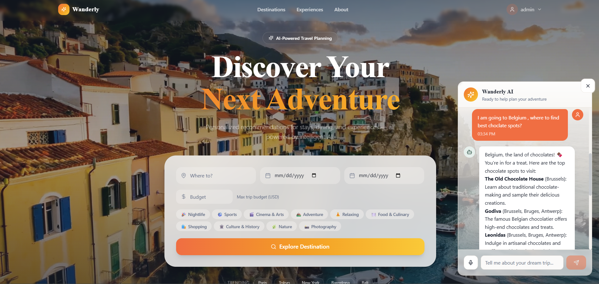
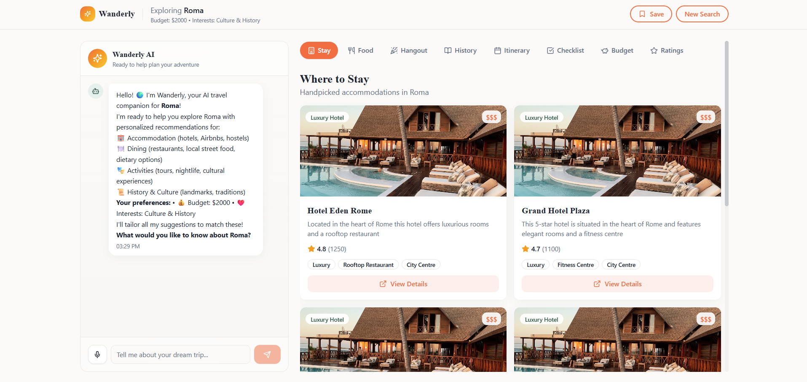
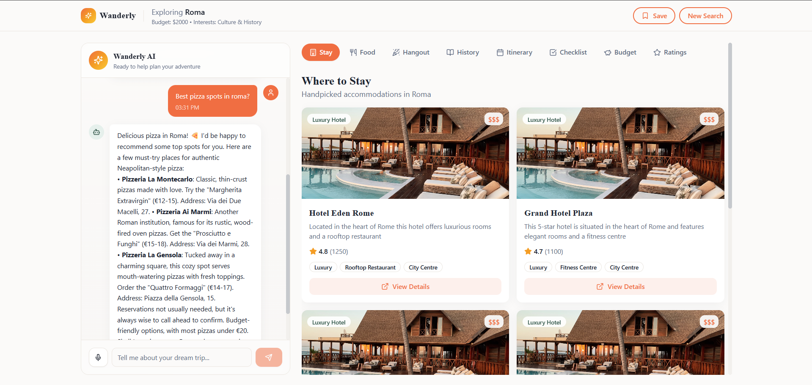
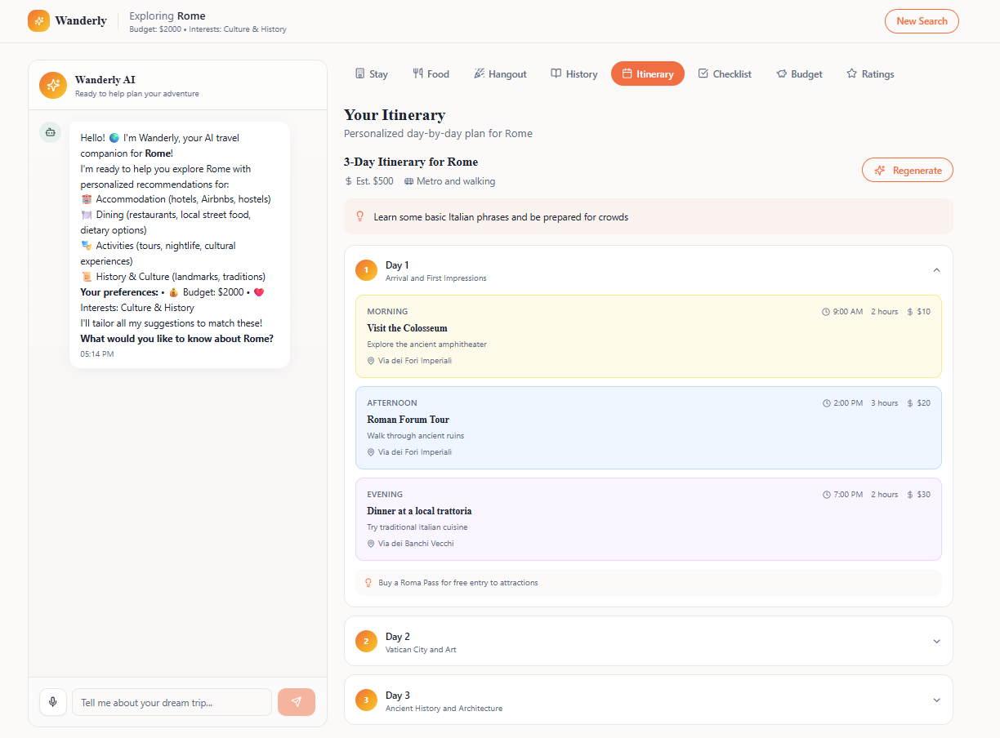
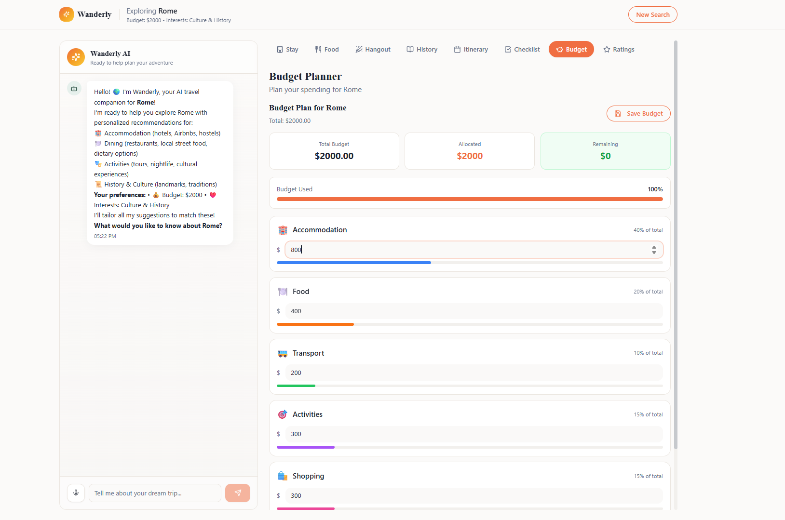
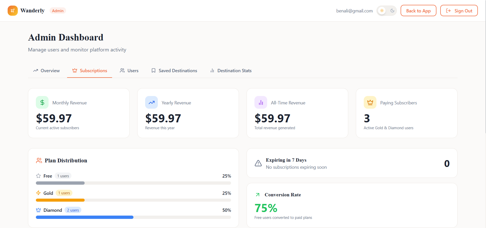

# Wanderly – AI-Powered Travel Planning Platform

🚀 A full-stack web platform designed to help users discover destinations, plan personalized trips, and organize their travel experience using AI-powered recommendations.

## 📘 Overview

The platform combines modern web technologies with **Artificial Intelligence** to provide users with a personalized and interactive travel planning experience. Users can explore destinations, generate personalized itineraries, manage their travel budget, and organize their trips from a single platform.

## 🎯 Objectives

* Help users discover travel destinations based on their preferences
* Generate personalized travel itineraries using AI
* Simplify the organization and planning of trips
* Help users estimate and manage their travel budget
* Provide a centralized platform for managing travel plans
* Offer an intuitive and modern user experience

## ⚙️ Technologies Used

### Frontend:

* React.js
* JavaScript
* HTML5
* CSS3

### Backend:

* Node.js
* Express.js

### Database:

* MySQL

### AI & APIs:

* Groq AI
* SerpAPI

### Tools:

* Git & GitHub
* Postman
* VS Code

## 🧠 Features

* 🔐 User authentication and account management
* 🌍 Destination discovery and exploration
* 🤖 AI-powered travel recommendations
* 🗺️ Personalized itinerary generation
* 💾 Saved destinations and travel plans
* 💰 Travel budget planning and management
* 📋 Trip checklists
* 📅 Trip organization and planning
* 💳 Subscription management
* 📊 Admin dashboard with platform statistics
* 📱 Responsive and user-friendly interface

### Prerequisites

* Node.js & npm
* MySQL Server
* Git

## 📸 Screenshots

👉 More screenshots are available in the Screenshots folder.

## 📚 Learning Outcomes

Through this project, we developed strong skills in:

* Full-stack web development
* RESTful API development
* Database design and SQL
* Artificial Intelligence integration
* API integration and data retrieval
* AI-powered recommendation systems
* UI/UX design
* Authentication and user management
* Git and GitHub version control
* Teamwork and project management

## 🚧 Future Improvements

* ✈️ Integration with flight and hotel booking services
* 🧠 More advanced AI-based travel personalization
* 🗺️ Interactive maps and route optimization
* 🌐 Multi-language support
* 💱 Multi-currency support
* 📱 Dedicated mobile application
* 🔔 Real-time notifications
* 👥 Social features for sharing trips and itineraries

## 📄 License

This project was developed for academic purposes as part of a **Projet de Fin d'Études (PFE)**.

All rights reserved © 2026.
